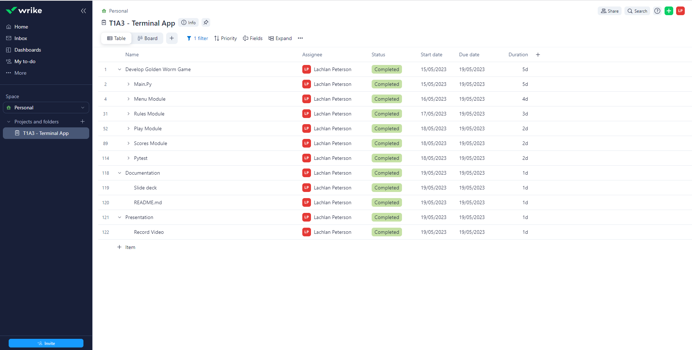
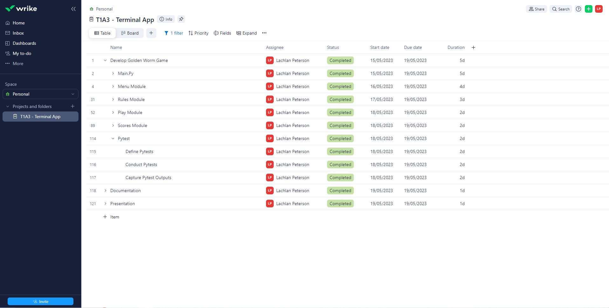

# LachlanPeterson_T1A3

This is a copy of the README file in my Deliverables to help users with installation from GitHub. 

The following project was created by **Lachlan Peterson** in order to fulfill the requirements of ***Coder Academy's*** Terminal Application Project **(T1A3)**.

---

## Table of contents
1. [Github Repository (R4)](#github-repository)
2. [Installation Guide (R8)](#installation-guide)
3. [Coding Style Guide (R5)](#coding-style-guide)
4. [Terminal Application: The Golden Worm](#terminal-application-the-golden-worm)
    - [Lore](#lore)
5. [Application Features (R6)](#application-features)
    - [Menu](#menu)
    - [User Control](#user-control-game)
    - [Worm Growth](#worm-growth-game)
    - [Worm Death](#worm-death-game)
    - [High Scores](#high-scores-game-and-menu)
6. [Development Plan (R7)](#development-plan)
7. [Presentation Video (R9/10)](#presentation-video)
8. [Future Updates](#future-updates)

---

## Github Repository

The following link will take you to the Github Repo for my Portfolio Assignment:

[*LachlanPeterson_T1A3 Github Repository*](https://github.com/LachlanPeterson/LachlanPeterson_T1A3)


---

## Installation Guide

*Note: Quotations will not be included in clipboard / terminal inputs. 
(I.e. 'Lachlan' should be input  as Lachlan)*  

<br>

1. **From the link provided above, navigate to the Github Repository.**
    - If you dont already have an account, you may need to create one before the next step.

<br>

2. **In Github, click the green "<> Code" button to activate the dropdown menu**
    - Clone the SSH Key and copy the link with the button to the write of the address.
    - You should have the following code copied on your clipboard: 
    'git@github.com:LachlanPeterson/LachlanPeterson_T1A3.git'

<br>

3. **Open your Terminal Application**
    - Change the current directory to the location you want the repository cloned.
    - Input the following command and Press Enter to create a local clone: <br> 
    'git clone {paste URL from clipboard}'
    
    ```
    git clone git@github.com:LachlanPeterson/LachlanPeterson_T1A3.git
    ```
    
<br>

4. **Execute Code with Bash Script:**
    - Input the following command in your Terminal Application:
    ```
    ./play_golden_worm.sh
    ```
    - The bash script should check whether you have Python3 installed and prompts you to install it. The game needs Python3.10 and Python3-pip to be installed in order to run. 
    - The script will also install the required packages from the requirements text file:
        - art==5.9
        - colorama==0.46
        - pytimedinput==2.0.1 
    - If an error occurs with Python or Pip you can also manually install Python3.10, pip and the packages with the following commands:
    ```
    sudo apt install python3.10
    sudo apt install Python3-pip
    python3 -m pip install -r requirements.txt
     ```

<br>

5. **Bash Script Error:**
    - Even if you have Python3.10 and Python3-pip installed before running the bash script, a permission denied error may still occur. 
    ```
    ./play_golden_worm.sh: Permission Denied
    ```
    - You can check your permissions in terminal by inputting (L): <br>
    ```
    ls -l
    ```
    - This command will let you view the permissions, and if you dont have the following, you cant run the script:
    ```
    -rwxr-xr-x  (on the same line before play_golden_worm.sh)
    ``` 
    - To enable permissions for the bash script to run, execute the following command:
    ```
    chmod +x play_golden_worm.sh
    ```
    - You should now have the permission to run the bash script, so try re-inputting the bash script:
    ```
    ./play_golden_worm.sh
    ```
<br>

6. **The Golden Worm Game (Terminal Application) should now be running!** 

<br>

[*Back to Top*](#lachlanpeterson_t1a3)

---

## Coding Style Guide

The following Terminal Application 'The Golden Worm' follows the PEP 8 Style Guide for Python Code. In order to style my code correctly, I opened the command palette in VS Code (Ctrl + shift + p) and selected a Linter (Python: Select Linter). After selecting the appropriate Linter for Pep 8 styling (pycodestyle), I updated my code accordingly where the Linter found any errors. Therefore, my code correctly follows the PEP 8 Style Guide (Reference below).

<br>

### PEP 8 Style Guide for Python Code
**Author:** Guido van Rossum, Barry Warsaw, Nick Coghlan <br>
**Status:** Active <br>
**Type:** Process <br>
**Created:** 05-July-2001 <br>
**Post-History:** 05-July-2001, 01-August-2013 <br>

<br>

[*Back to Top*](#lachlanpeterson_t1a3)

---
    
## Terminal Application: The Golden Worm

The purpose of this project was to design, implement, create and test a terminal application - demonstrating my ability to use a range of developer tools. The application was required to accept user input (through file or text input) and produce a printed output, allowing users to interact with the application. 

To achieve this, I have designed, developed and deployed a terminal application that showcases my newly learned Python coding experience. Instead of doing a regular text input and output adventure game, I wanted the application to be more interactive, however still allowing for a story / lore to be created. 

Thus, The Golden Worm was born. The Golden Worm is an interactive text input/output game that remasters the classic game 'snake'. Users interact with the application through text input, navigating through menus/prompts and specifically when controlling the worm in the game feature. The application outputs and prints different menus/prompts based on user input and importantly, it reprints the terminal while playing the game on a timedinput. This gives the impression of movement within the game, and allows users to play the worm game within 'The Golden Worm' in the Terminal without any GUI displays.

<br>

### Lore:

The Golden Worm follows the journey of the user (who is a worm) as they enter a new garden. They are greeted by a Golden worm named Greg who tells them about the secrets of his garden. His garden contains gold nuggets that allow worms to transform and evolve, however once you start the game you cannot leave the garden without eating all the gold. 

If the user dies in the game, its implied that Greg revives you with his miraculous gold powers, allowing you to try again. If you manage to eat all the gold nuggets you evolve into a Golden worm. After evolving, you decide to leave the garden after thanking Greg and you tell other worms about the special Garden. This is reflected in the game winning sequence, as after beating the game you leave the garden and Greg then the introduction with Greg is played again. This was to imply the original user has left the garden, told his worm friends how to evolve, and a new worm (user) has arrived. 

[*Back to Top*](#lachlanpeterson_t1a3)

---

## Application Features

The main features of the application are listed in further detail below. These 5 features were refined after consulting with educators at Coder Academy over Discord.

Overall, the application users an interactive menu with different options that are selected by the text input from the user. Different outputs are presented based on these inputs. The main feature of the application is the playable game screen - where the worm(user) tries to eat the gold nuggets. 

The application also prints users names and scores to a csv file.  

<br>

### Menu:

The Golden Worm utilises a menu feature to navigate through the different text outputs (or pages) from the application. It contains the following main options: <br>

1. Play (When input - sends users to the game screen)
2. Rules (When input - sends users to the rules screen)
3. Scores (When input - sends users to the scores screen)
4. Exit (When input - it prints a message and closes the application) 

Each screen is created by specific text outputs, and when the user is 'sent to a specific screen', the application is clearing the terminal and printing the text output for the new page. Each page will contain sub-menu's that allows the users to navigate between different screens through text input. 

<br>

[*Back to Top*](#lachlanpeterson_t1a3)

<br>

### User Control (Game):

In the game, the user controls the worms movement through the W,A,S,D Keys. If a user presses a movement key, a text input is processed, making the worm move. However, because this application uses text input and output, it cannot physically move the worm without a GUI. 

Therefore, in order to 'move' the worm, the application is actually updating the worms position in a list of tuples (field). It clears the terminal, and reprints the whole game screen on a timed input with the updated worm position. 

To move, the worm is updated according to the following logic:
- Game screen is printed with new worm position.
- Player inputs a movement direction.
- The new head will become the old head + the direction pressed (WASD).
- The tail is then removed
- The board is then cleared and the process repeats.


<br>

[*Back to Top*](#lachlanpeterson_t1a3)

<br>

### Worm Growth (Game):

The Worm Growth feature uses the randomly generated gold nuggets within the board to grow the worm when its head is in the same position as the gold. This implies that the worm is eating the gold nuggets. Basically, if the worm head touches 'G' then it will 'eat it' and grow in length. Once the worm has grown and the gold has been eaten, a new gold nugget will be generated. 

In order to grow the worm, the logic from the movement or user control feature was used but with a key difference:
- Game screen is printed with new worm position.
- Player inputs a movement direction.
- The new head will become the old head + the direction pressed (WASD).
- **If the new head is in the same position as a gold nugget, then the tail is NOT removed.** 
- The board is then cleared and the process repeats.

Therefore, instead of removing the tail when the terminal reprints the updated game screen, the old tail remains as you have eaten gold. Thus, giving the impression that the worm grew. 

<br>

[*Back to Top*](#lachlanpeterson_t1a3)

<br>

### Worm Death (Game): 

Like the classic snake game, the worm dies when it runs into its tail, body or head. You will also die if you hit the border of the play area, in this case the garden (as show by Green '@').

Again, the Worm Death feature works in conjunction with the worm movement. If the worm head position is in any of the following positions after the board update, then you die:

1. If worm head position = any position in the border.
2. If you are going in a direction and the user inputs the opposite direction, you will die as the new head is updated to be within the old head.
3. If worm head position touches any other positions the worm body is occupying.

However, when you die you will have the option to retry or go back to the main menu. Also, upon death the code will pass the users store to the scores module. 

<br>

[*Back to Top*](#lachlanpeterson_t1a3)

<br>

### High Scores (Game and Menu):

The High Scores feature is accessible from the main menu in the Application. It contains 3 Top scores by default, that the player can try to beat in the game. If the user is able to beat any of the high scores, the list will be updated with the users name and their score. Therefore the logic is as follows:

1. If the users score (passed from game screen when worm dies or wins) is greater than any of the 3 default High Scores, replace the score.
2. If a replaced score > other scores in the list, replace the next score. 
3. Update the list. 
4. If a player continues to play and beats their previous score, thus updating the high scores list, it will only update their previous score. This is because the list contains the top score of different worms, rather than the 3 best scores. 
5. The updated high scores list can be viewed from the main menu, and any changes in scores due to player scores can be seen. 
6. All scores - regardless of whether they make the high scores list - will be passed into a seperate csv file. 

<br> 

[*Back to Top*](#lachlanpeterson_t1a3)

---

## Development Plan
Link to my development plan:

[*LachlanPeterson_T1A3 Development Plan*](https://www.wrike.com/workspace.htm?acc=6106395&wr=20#folder/1118473996/tableV2?filters=status%3Dactive&spaceId=1118473015&viewId=161357827)

Screenshots from my Development Plan:



.PNG)
.PNG)



<br>

[*Back to Top*](#lachlanpeterson_t1a3)

---

## Presentation Video
The following link will take you to my Presenation Video for my Terminal Application 'The Golden Worm':

[*Lachlan Peterson's Terminal Application*](https://www.youtube.com/watch?v=2xaLXmtHvA8)

<br>

[*Back to Top*](#lachlanpeterson_t1a3)

---

## Future Updates

Here are some of the planned future updates and features for the next version of The Golden Worm:

**Update Menu and Game to Include difficulty settings**
1. The field size can be changed (reduced or increased)
2. Objects could be randomly printed or generated onto the field for different levels (kills the worm if hit - like the border).
3. Pytimer can be used to slow the reprinting of the terminal in the game screen. Increase pytimer value to make the game slower(Easy), decrease to increase speed (Hard).

**Different Playable Characters**
- A class could be created for each character or worm.
- Different worms could have different colours and names.

<br>

[*Back to Top*](#lachlanpeterson_t1a3)

---